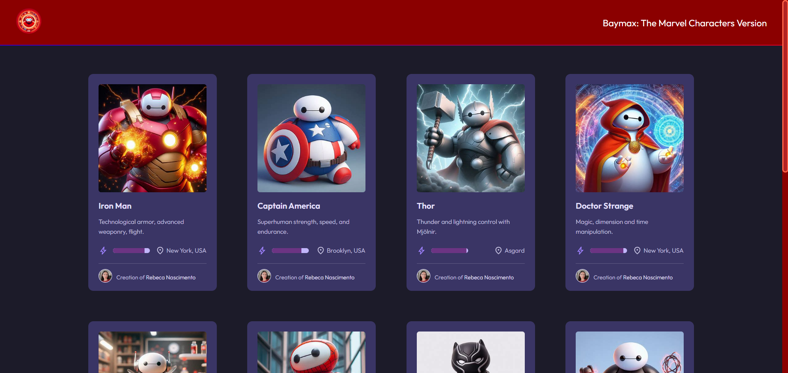
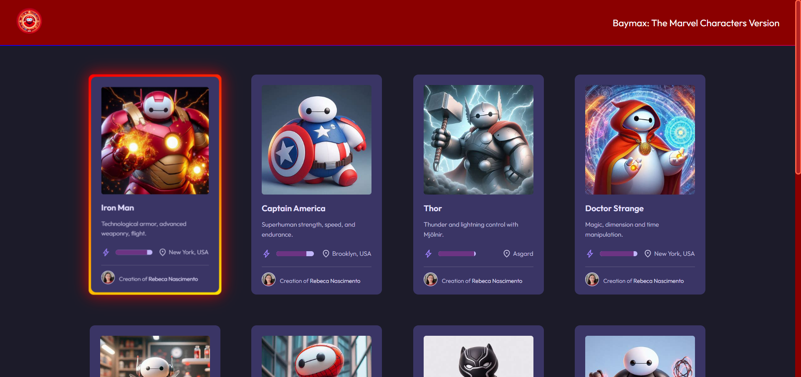

# Portfolio - Baymax: The Marvel Characters Version
This site features several cards with images of Baymax, from the movie Big Hero 6, as Marvel characters. In addition to the images, the cards feature a description of the character's power, a bar showing the power level, and the character's place of origin. The cards feature a personalized hover for each hero (or villain) shown on the card.

### Screenshot
Below are examples of the site's interactive cards and their hover effects: 

### Links

- You can access this site via the link: [Baymax: The Marvel Characters Version](https://rebeca018.github.io/portfolio/)

- **GitHub Repository**: [View Source Code](https://github.com/rebeca018/portfolio)

## Technologies 

### Core Technologies:
- HTML
- CSS
- JavaScript

### Styling:
- Flexbox
- CSS Transitions e Transformations
- CSS Variables
- CSS Box-Shadow
- Hover Effects
- Tooltip

### Tools and Libraries:
- [Google Fonts](https://fonts.google.com/)
- [UI Verse](https://uiverse.io/) - For the colored hover
- [Animate.css](https://animate.style/) - For animation

### Resources:
- [Bing](https://www.bing.com/images/create) - For images

## Author
Developed by [Rebeca Nascimento](https://www.linkedin.com/in/rebeca-nascimento018/)

- **GitHub**: [rebeca018](https://github.com/rebeca018)
- **LinkedIn**: [Rebeca Nascimento](https://www.linkedin.com/in/rebeca-nascimento018/)  